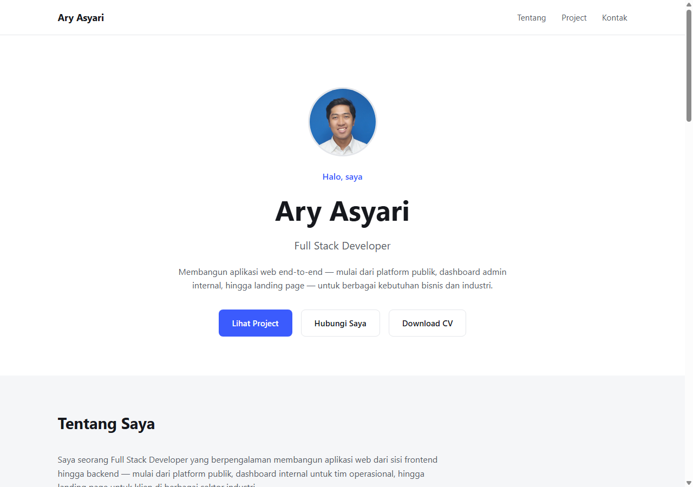

# Ary Asyari — Portofolio

Situs portofolio pribadi, dibangun dengan HTML, CSS, dan JavaScript murni (tanpa framework),
di-deploy lewat GitHub Pages.

🔗 **Live demo:** https://ary-asyari.github.io/portofolio/



## Isi

- **Profil** — Full Stack Developer
- **Project**
  - *Algo Research ecosystem*: homepage riset pasar modal, Circle CMS Dashboard, Data Dashboard
    (chart template builder), Subscription Master App
  - *Client projects*: GEOSAT (geospatial tracking), MSP (ship-to-shore communication),
    HEPI Property (portal listing properti), Bhumi Gaea Surya (landing page perumahan)

Tiap project ditampilkan sebagai kartu dengan screenshot (klik untuk memperbesar), deskripsi,
dan fungsi singkatnya. Link situs live bisa ditambahkan lewat atribut `data-link` pada
elemen `.card` di `index.html`.

## Struktur

```
index.html
css/style.css
js/script.js
assets/images/      # screenshot project (terkompresi untuk web)
```

## Menjalankan lokal

Buka `index.html` langsung di browser, atau serve dengan server statis apa pun, misalnya:

```
npx serve .
```

## Deploy

Situs ini di-deploy lewat **GitHub Pages** dari branch `main`.
